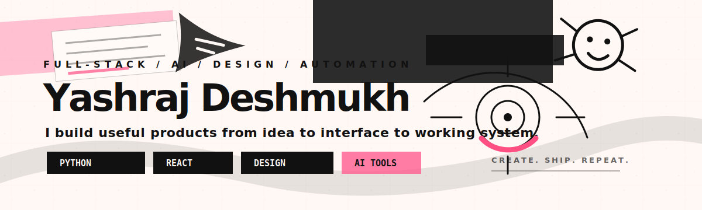
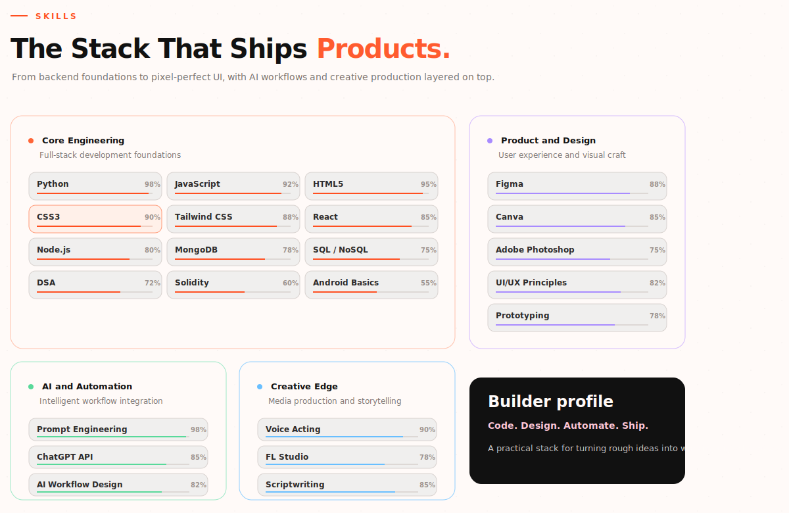

<p align="center">
  
</p>

<p align="center">
  <a href="https://github.com/yashrajds?tab=repositories">
    
  </a>
  <a href="https://www.linkedin.com/in/yashrajdm">
    
  </a>
  <a href="https://www.instagram.com/ysrj.flp">
    
  </a>
</p>

<br />

## Hey, I am Yashraj.

I am a builder who likes turning rough ideas into working products.  
My work sits around **software engineering, product design, AI automation, computer vision, and creative tools**.

```txt
role          full-stack developer / product builder
focus         useful apps, AI workflows, clean interfaces, automation
style         practical engineering with strong visual taste
direction     build fast, design well, ship things people can actually use
```

## What I Build

| Area | What I care about |
| --- | --- |
| Full-stack products | Web apps, dashboards, tools, APIs, databases, auth flows, and complete product experiences. |
| AI and automation | Prompt systems, AI workflows, local assistants, task automation, and LLM-powered utilities. |
| Design and UI | Clean interfaces, product polish, prototypes, responsive layouts, and interaction details. |
| Computer vision | Webcam interaction, gesture control, tracking experiments, and perception-based interfaces. |
| Creative systems | Voice, music tools, video editing, scripting, and storytelling for digital projects. |

## Skills

<p align="center">
  
</p>

## Selected Projects

| Project | Type | Snapshot |
| --- | --- | --- |
| [OrionVA](https://github.com/yashrajds/OrionVA) | Desktop AI assistant | Local-first assistant with voice, automation, vision, and a custom desktop UI. |
| [Youmotion](https://github.com/yashrajds/Youmotion) | Computer vision | Webcam hand gesture control for YouTube-style interaction. |
| [AskMyNotes-HackSphere](https://github.com/yashrajds/AskMyNotes-HackSphere) | AI study tool | Note-based Q&A assistant for extracting answers from academic material. |
| [Sudoku-Master](https://github.com/yashrajds/Sudoku-Master) | Game utility | Sudoku game with puzzle generation and validation. |
| [elec-calc](https://github.com/yashrajds/elec-calc) | Utility app | Electricity bill calculator with slabs, fixed charges, GST, and validation. |

## Tech I Use

<p>
  
  
  
  
  
  
  
  
  
</p>

```txt
engineering      Python, JavaScript, HTML, CSS, React, Node.js, MongoDB, SQL / NoSQL
ai systems       prompt engineering, ChatGPT API, Gemini API, workflow design, LLM integration
design           Figma, Canva, Photoshop, UI/UX principles, prototyping
creative         voice acting, FL Studio, Premiere Pro, scriptwriting
```

## GitHub Signal

<p align="center">
  
  
</p>

## Currently Exploring

```txt
AI-powered workflows
real-time computer vision
clean product interfaces
automation-first utilities
creative tools for digital media
```

## Connect

If you build things, design things, automate things, or just like ambitious product ideas, say hi.

<p>
  <a href="https://www.linkedin.com/in/yashrajdm">LinkedIn</a>
  /
  <a href="https://www.instagram.com/ysrj.flp">Instagram</a>
  /
  <a href="https://github.com/yashrajds?tab=repositories">Projects</a>
</p>
